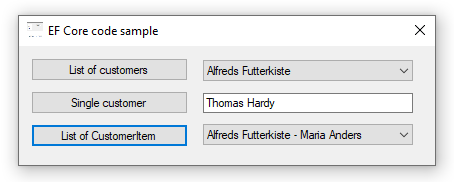

### Entity Framework Core 3 VB.NET projections

Contains code samples for Entity Framework Core

* Console logging
* Projections
* Asynchronous operations
* Extension methods

Microsoft TechNet article



```
Public Class Form1
    Private Async Sub ListCustomersButton_Click(sender As Object, e As EventArgs) Handles ListCustomersButton.Click
        Dim customers As List(Of Customers) =
                Await Operations.ReadCustomers()

        CustomersComboBox.DataSource = customers

    End Sub
    Private Async Sub SingleCustomerButton_Click(sender As Object, e As EventArgs) Handles SingleCustomerButton.Click
        Dim singleCustomer As Customers =
                Await Operations.ReadCustomer(4)

        ContactNameTextBox.Text = singleCustomer.ContactName

    End Sub
    Private Async Sub ListCustomerItemsButton_Click(sender As Object, e As EventArgs) Handles ListCustomerItemsButton.Click
        Dim customerItem As List(Of CustomerItem) =
                Await Operations.ReadCustomersProjected()

        CustomerItemComboBox.DataSource = customerItem

    End Sub

End Class
```


#### Console logging
```
Public Shared ReadOnly ConsoleLoggerFactory As ILoggerFactory = LoggerFactory.
    Create(Function(builder) As ILoggerFactory
               builder.AddFilter(
                   Function(category, level)
                       Return category = DbLoggerCategory.Database.Command.Name AndAlso level = LogLevel.Information
                   End Function)

               builder.AddConsole()

               Return Nothing

           End Function)
```

#### Projections

```
Public Class CustomerItem
    Public Property CustomerIdentifier() As Integer
    Public Property CompanyName() As String
    Public Property ContactName() As String
    Public Property ContactId() As Integer?
    Public Property CountryIdentifier() As Integer?
    Public Property CountryName() As String
    Public Property ContactTypeIdentifier() As Integer?

    Public Overrides Function ToString() As String
        Return $"{CompanyName} - {ContactName}"
    End Function

    Public Shared ReadOnly Property Projection() As Expression(Of Func(Of Customers, CustomerItem))
        Get
            Return Function(customers) New CustomerItem() With {
                    .CustomerIdentifier = customers.CustomerIdentifier,
                    .CompanyName = customers.CompanyName,
                    .ContactId = customers.ContactId,
                    .ContactName = $"{customers.Contact.FirstName} {customers.Contact.LastName}",
                    .CountryIdentifier = customers.CountryIdentifier,
                    .CountryName = customers.CountryIdentifierNavigation.Name,
                    .ContactTypeIdentifier = customers.CountryIdentifier
                }
        End Get
    End Property
End Class
```
